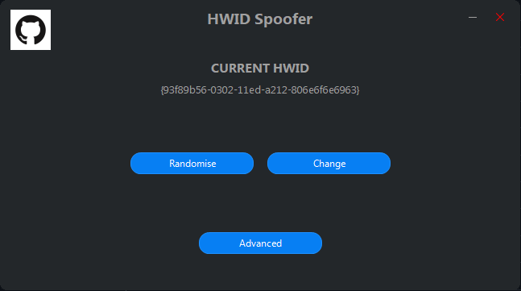
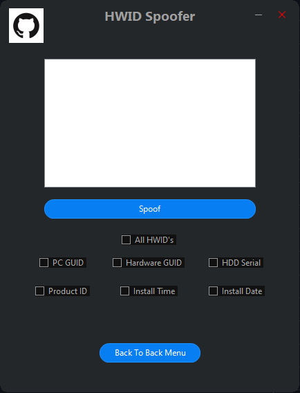

<h3 align="center">HWIDSpoofer</h3>

Simple GUI C# HWID spoofer.

### Screenshots
  
  

#### Warning
This is not an officially supported application. It was created to bypass HWID blocks which may not be allowed. If you are afraid, you can build it from source by yourself. Also please don't download it from any third-party sites.

#### Download ()
Please go to [releases page](https://github.com/JaredWestley/VirusTotalChecker/releases) to download the compiled exe. *Don't forget to star the repo!*

#### How to get API key
It is really simple! All you need to do is to go to [VirusTotal official page](https://www.virustotal.com/), create profile and copy your key.

#### How to use
It is very easy! Select randomise and press set and restart to do a basic HWID spoof, or dive into the advanced menu to spoof HWID with a bunch of different options

#### Contributing
If you have any idea how to make this app better, please [create a pull request](https://github.com/JaredWestley/HWIDSpoofer/compare). If you find any bug, please [create an issue](https://github.com/JaredWestley/HWIDSpoofer/issues/new).

#### License
This project is licensed under an MIT license. Please check [LICENSE](LICENSE).
